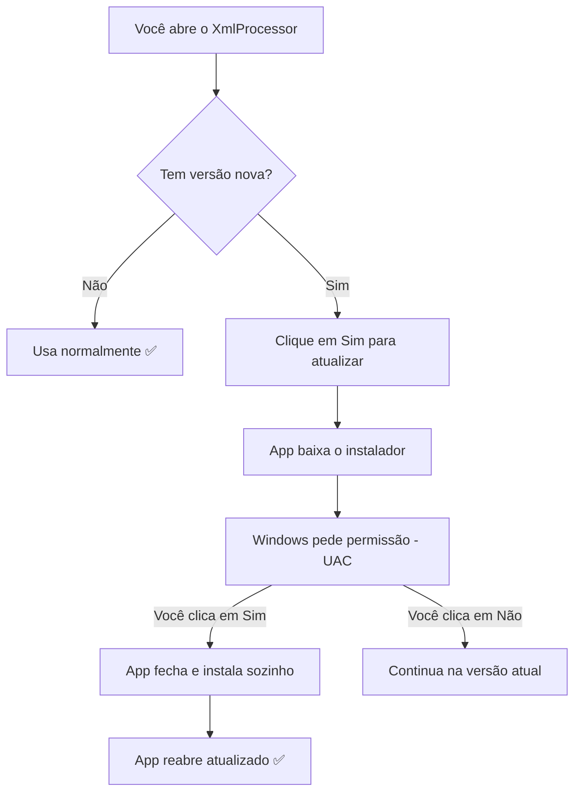
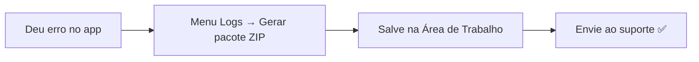

# XmlProcessor — Central de Atualizações

Esta página é o **ponto oficial de download** do **XmlProcessor (Ferramentas contábeis — SPED Fiscal / NFe)**.
Aqui você sempre encontra a versão mais nova do instalador para Windows.

> 👉 **Para baixar agora:** acesse
> [**Releases — versão mais recente**](https://github.com/vic012/xml-releases/releases/latest),
> baixe o arquivo `XmlProcessor-Setup-X.Y.Z.exe` e execute. Não precisa
> desinstalar a versão antiga: a nova instala **por cima**.

---

📚 <strong>Manual das funções — clique para abrir o índice</strong>

 

- [⚙️ Gerar o SPED com parcelas (função principal)](docs/01-processar-sped.md)
- [📥 Banco de Parcelas — virada de mês](docs/02-banco-de-parcelas.md)
- [🧩 Layouts C140/C141](docs/03-layouts-c140-c141.md)
- [🔑 Licença e ativação](docs/04-licenca-e-ativacao.md)
- [🔄 Atualizações automáticas](docs/05-atualizacoes.md)
- [🩺 Diagnóstico e suporte (menu Logs)](docs/06-diagnostico-e-suporte.md)

---

## 1. Como atualizar pelo próprio aplicativo (recomendado)

Você não precisa vir até aqui na maioria das vezes. O aplicativo avisa
sozinho quando sai versão nova:

1. Abra o XmlProcessor.
2. Se aparecer a mensagem **"Atualização disponível"**, clique em **Sim**.
   (Ou abra o menu **Ajuda → Verificar atualizações...** a qualquer momento.)
3. Aguarde o download terminar.
4. Quando o Windows perguntar **"Deseja permitir que este aplicativo faça
   alterações?"**, clique em **Sim** — é a instalação da atualização.
5. O aplicativo fecha, atualiza e **abre sozinho** na nova versão.

> 💡 **Sua chave de licença continua valendo.** Atualizar não apaga nada:
> nem a chave, nem seus layouts, nem seus arquivos.

---

## 2. Primeira instalação

1. Baixe o `XmlProcessor-Setup-X.Y.Z.exe` em
   [**Releases**](https://github.com/vic012/xml-releases/releases/latest).
2. Execute o arquivo e siga as telas (pode confirmar o aviso do Windows).
3. Abra o aplicativo e **ative com a chave de licença** que você recebeu
   (formato `XXXX-XXXX-XXXX-XXXX-XXXX`). A chave só é pedida uma vez.

---

## 3. Se algo der errado: como pedir ajuda ao suporte

O aplicativo gera um **pacote de diagnóstico** com tudo que o suporte
precisa. Leva menos de 1 minuto:

1. No aplicativo, abra o menu **Logs → Gerar pacote de diagnóstico (ZIP)...**
2. Salve o arquivo (ele sugere a Área de Trabalho).
3. Envie o arquivo `.zip` ao suporte pelo **WhatsApp ou e-mail**.

> O pacote contém apenas dados técnicos (versão e trechos dos logs).
> Não contém sua chave de licença.

---

## 4. Problemas comuns

| Problema | O que fazer |
|---|---|
| Windows perguntou se permite alterações | Clique em **Sim**. Sem isso a atualização não instala. |
| Atualizou mas o app não reabriu | Abra pelo atalho da Área de Trabalho. A versão nova já está instalada (confira em **Ajuda**, ao lado do nome da versão). |
| "Não foi possível verificar atualizações" | Verifique a internet e tente de novo em **Ajuda → Verificar atualizações...** |
| Antivírus bloqueou o instalador | É um falso positivo comum em apps novos. Libere o arquivo `XmlProcessor-Setup-*.exe` e rode de novo. |
| Pediu a chave de licença de novo | Use a mesma chave que você já tinha. Se perdeu, fale com o suporte. |

---

## Histórico de versões

Todas as versões, com data e arquivos, estão em
[**Releases**](https://github.com/vic012/xml-releases/releases).
