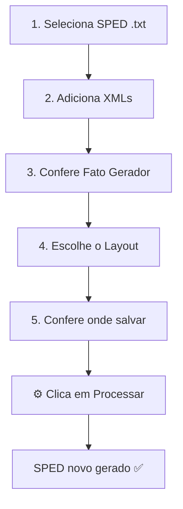
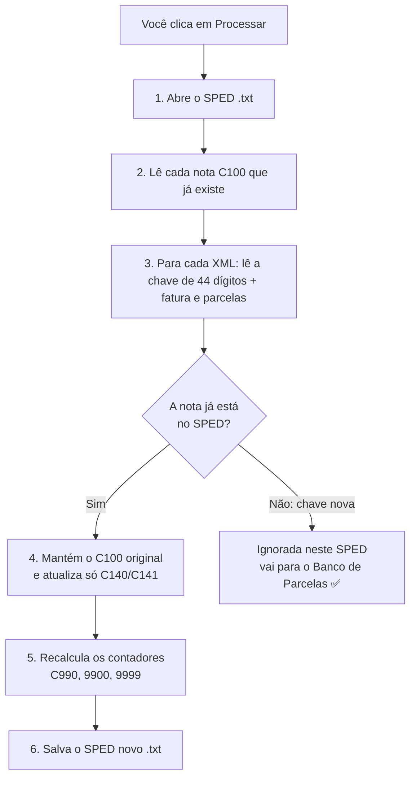
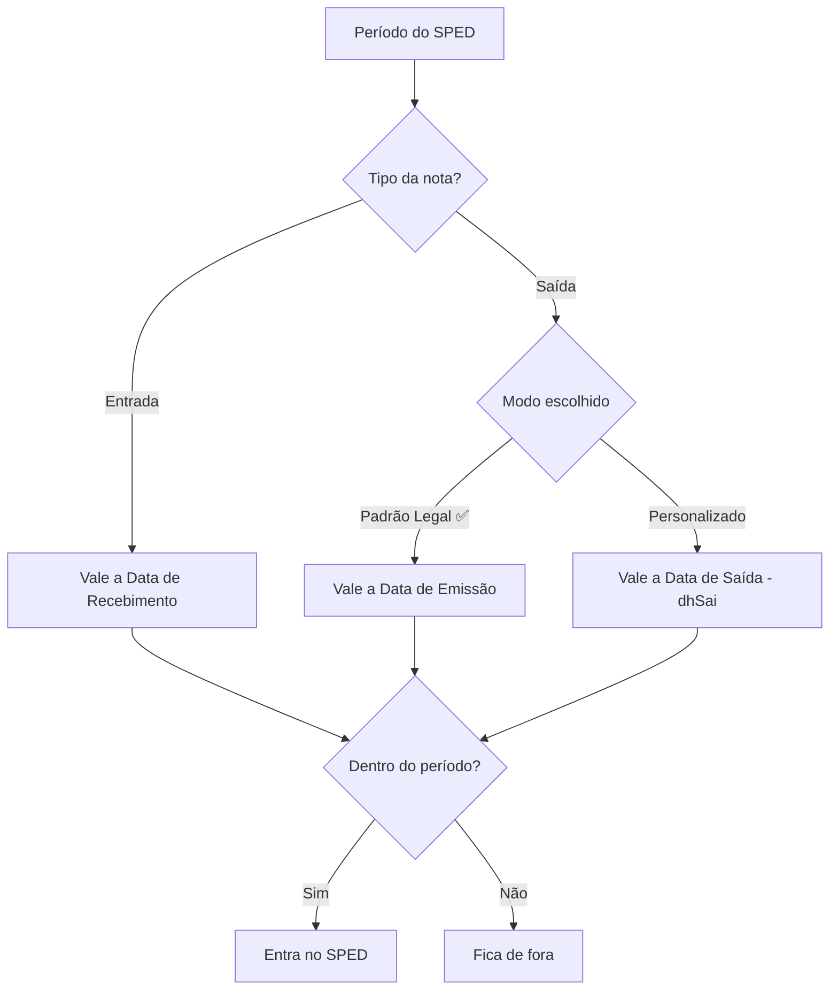

# Gerar o SPED com parcelas (função principal)

Esta é a função central do XmlProcessor: pegar o seu **SPED Fiscal (.txt)**
e os **XMLs das NFes** e gerar um **SPED novo** com as faturas e parcelas
(blocos C140/C141) já preenchidas. O arquivo original **nunca é alterado**.

## Passo a passo na tela principal

A tela é numerada de 1 a 6 — basta seguir a ordem:

| Passo | Seção da tela | O que fazer |
|---|---|---|
| 1 | Arquivo SPED de origem (.txt) | Clique em **📁 Selecionar SPED...** e escolha o `.txt` que veio do escritório |
| 2 | XMLs da NFe | **➕ Adicionar arquivos...** (um por um) ou **📂 Selecionar pasta...** (mil de uma vez) |
| 3 | Fato Gerador | Deixe **Padrão Legal** (recomendado). Só mude em caso de exceção (veja abaixo) |
| 4 | Layout C140/C141 | Escolha o perfil no dropdown (ex.: "Padrão SPED Atual") |
| 5 | Salvar o novo SPED | O app sugere o nome sozinho; mude com **💾 Salvar como...** se quiser |
| 6 | Banco de Parcelas | Opcional — só para virada de mês ([veja o guia](02-banco-de-parcelas.md)) |

Depois clique em **⚙ Processar** e aguarde a mensagem de conclusão.

## O que o sistema faz com cada nota

> **Importante:** o sistema **não cria nota nova** no SPED. Se o XML é de
> uma NF que não está no `.txt` selecionado (chave de 44 dígitos inédita),
> ela fica de fora do resultado com o aviso *"chave não encontrada no SPED,
> ignorada"* — e é **guardada sozinha no Banco de Parcelas**, para entrar
> automaticamente quando você processar o SPED do mês dela. Nada se perde.
> ([Como funciona o banco](02-banco-de-parcelas.md))

### O que é cada bloco

| Bloco | O que representa | Exemplo |
|---|---|---|
| **C100** | A nota fiscal (cabeçalho) | número, data, valor, impostos |
| **C140** | A fatura da nota | "vou pagar em 3 vezes" |
| **C141** | Uma parcela | "1ª parcela: R$ 500 em 15/09" |
| **C170** | Cada item da nota | "10 caixas de arroz" |
| **C190** | Total por tipo de operação | "vendas somam R$ 1.000" |

## Qual data vale? (Fato Gerador)

O SPED tem um período (de → até). Para decidir se a nota entra nele:

> **Dica:** só use **Personalizado** quando a data de saída (`dhSai`) da
> nota for diferente da data de emissão (`dhEmi`) e você precisar que ela
> caia no mês da saída.

## Garantias

- O **SPED original nunca muda** — o resultado vai para um arquivo novo.
- Se a nota já existia no SPED, o `C100` dela fica **idêntico, byte a byte**;
  só o grupo `C140/C141` é atualizado.

---
← [Voltar ao início](../README.md) · Próximo: [Banco de Parcelas](02-banco-de-parcelas.md)
