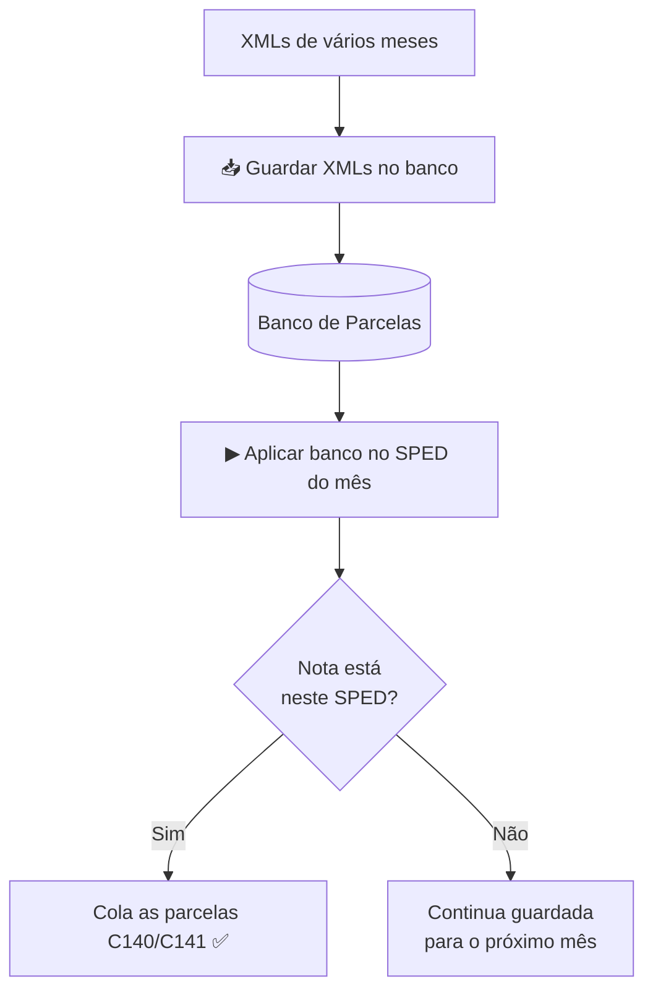

# Banco de Parcelas (virada de mês)

Quando os XMLs são de **vários meses** e o SPED é de **um mês só**, processar
direto dá trabalho: nota fora do período fica de fora. O Banco de Parcelas
resolve isso em 2 fases: **guardar** tudo primeiro, **aplicar** depois.

## Quando usar

- ✅ Virada de mês (XMLs de setembro + outubro, SPED só de setembro)
- ✅ Lote grande de XMLs para organizar aos poucos
- ❌ Não precisa: SPED e XMLs do mesmo mês → processe direto
  ([guia principal](01-processar-sped.md))

## Como funciona

1. Clique em **📥 Guardar XMLs no banco** (aceita XMLs de vários meses, sem
   filtro de período).
2. Com o SPED do mês na tela, clique em **▶ Aplicar banco no SPED**.
3. O sistema cola as parcelas só nas notas daquele SPED. O que sobrar
   **fica guardado** para o mês seguinte — nada se perde.
4. Para ver ou limpar o guardado, use **🗑 Limpar banco...** (cuidado: apaga
   o que ainda não foi aplicado).

---
← [Voltar ao início](../README.md) · Anterior: [Processar SPED](01-processar-sped.md) · Próximo: [Layouts C140/C141](03-layouts-c140-c141.md)
