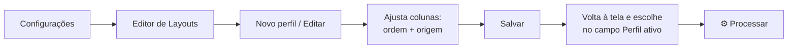
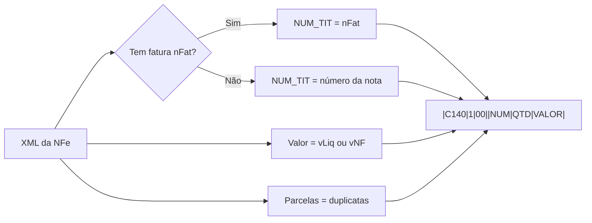

# Layouts C140/C141 (perfis de campos)

O **layout** é a "receita" que diz quais campos o sistema escreve nos
blocos C140 (fatura) e C141 (parcelas), e de onde vem cada valor. O perfil
**"Padrão SPED Atual"** serve para a maioria dos casos; crie outros perfis
só se o seu contador pedir um formato diferente.

## Criar ou editar um perfil

Abra o menu **Configurações → Configurar Layouts C140/C141...**



Para cada coluna você escolhe a **origem**:

| Origem | O que faz | Exemplo |
|---|---|---|
| **Texto Fixo** | Escreve o valor literal | `C140`, `00`, `1` |
| **Tag XML** | Puxa do XML da NFe | `nFat`, `vDup`, `dVenc` |
| **Vazio** | Deixa em branco | separador de campo |

## Como o C140 padrão é montado



Exemplo real (7 campos, na ordem do manual da Receita):

```
|C140|1|00||720390|03|1167,00|
```

| Posição | Campo | Significado |
|---|---|---|
| 1 | `C140` | Nome do bloco (fixo) |
| 2 | `1` | Emitente: terceiros |
| 3 | `00` | Tipo de título: Duplicata |
| 4 | *(vazio)* | Descrição do título |
| 5 | `720390` | Número da fatura |
| 6 | `03` | Quantidade de parcelas |
| 7 | `1167,00` | Valor total |

---
← [Voltar ao início](../README.md) · Anterior: [Banco de Parcelas](02-banco-de-parcelas.md) · Próximo: [Licença e ativação](04-licenca-e-ativacao.md)
