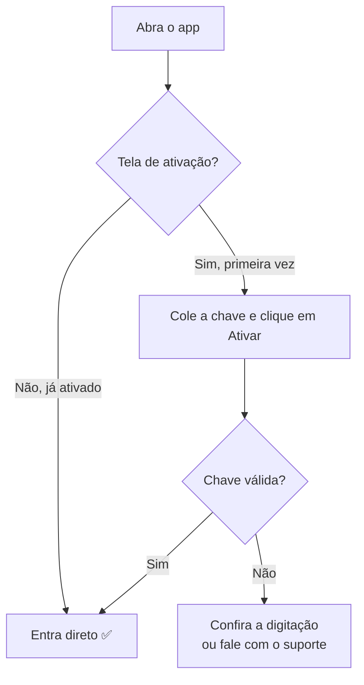

# Licença e ativação

O XmlProcessor só funciona com uma **chave de licença** válida
(formato `XXXX-XXXX-XXXX-XXXX-XXXX`), que você recebe do suporte.

## Ativar pela primeira vez

1. Na tela de ativação, cole a chave no campo e clique em **Ativar**.
2. Pronto — nas próximas vezes o app **entra direto**, sem pedir nada.

## O que você precisa saber

- **Atualizar não pede a chave de novo.** A licença fica guardada no seu
  computador e sobrevive a atualizações e reinstalações.
- **Sem internet o app não processa**: ele confirma a licença no servidor
  ao abrir e a cada 60 segundos. Sem conexão, só dá para ver telas.
- **Chave expirada ou inválida?** O app avisa na abertura e pede uma nova.
  Fale com o suporte para renovar.
- **Trocou de computador?** A chave é vinculada à máquina — peça ao suporte
  para liberar a ativação no PC novo.

---
← [Voltar ao início](../README.md) · Anterior: [Layouts](03-layouts-c140-c141.md) · Próximo: [Atualizações](05-atualizacoes.md)
