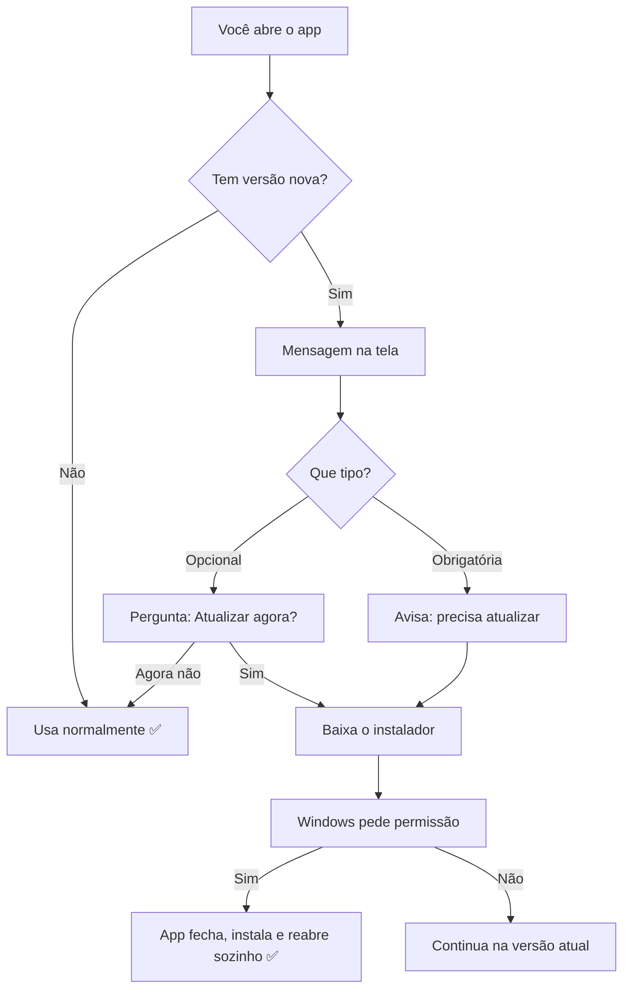

# Atualizações automáticas

O aplicativo verifica sozinho se saiu versão nova e instala **por cima**,
sem desinstalar nada e sem apagar chave, layouts ou arquivos.

## Como acontece

Detalhes:

- A checagem acontece **ao abrir** o app, **a cada 6 horas** e quando você
  clica em **Ajuda → Verificar atualizações...**
- Atualização **opcional**: você escolhe a hora. **Obrigatória**: só em
  casos importantes (ex.: mudança da Receita) — o app explica na tela.
- O download é verificado por **código de segurança (SHA-256)**: se o
  arquivo vier corrompido, a instalação é recusada sozinha.
- Se o app não reabrir sozinho após atualizar, abra pelo atalho: a versão
  nova já está instalada (confira em **Ajuda**, ao lado da versão).

---
← [Voltar ao início](../README.md) · Anterior: [Licença](04-licenca-e-ativacao.md) · Próximo: [Diagnóstico e suporte](06-diagnostico-e-suporte.md)
