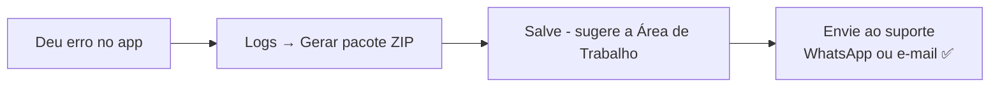

# Diagnóstico e suporte (menu Logs)

O menu **Logs** guarda tudo que aconteceu no app. São 4 funções:

| Função | Para que serve |
|---|---|
| **Ver logs...** | Ver na tela o que o app fez, com abas Todos / Informações / Erros e campo de filtro |
| **Exportar logs (CSV)...** | Salvar a lista da tela em planilha |
| **Abrir log técnico (app.log)...** | Abrir o arquivo técnico completo (para olhar ou enviar) |
| **Gerar pacote de diagnóstico (ZIP)...** | Criar o pacote pronto para mandar ao suporte ⭐ |

## Quando pedir ajuda: envie o pacote ZIP

O pacote contém: versão do app e do Windows, trechos finais dos logs
técnicos e o resumo da sessão. **Não contém sua chave de licença.**

## Onde ficam os arquivos (se precisar achar na mão)

| Arquivo | Onde fica no Windows | O que é |
|---|---|---|
| `app.log` | `%LocalAppData%\XmlProcessor\logs\` | Log técnico completo |
| `license.db` | `%LocalAppData%\XmlProcessor\` | Sua chave (não precisa mexer) |
| `jobs.db` | `C:\Users\<você>\.xml-processor\` | Seus layouts |

> 💡 Dica: cole `%LocalAppData%\XmlProcessor` na barra do Explorer e tecle
> Enter — abre a pasta direto.

---
← [Voltar ao início](../README.md) · Anterior: [Atualizações](05-atualizacoes.md)
